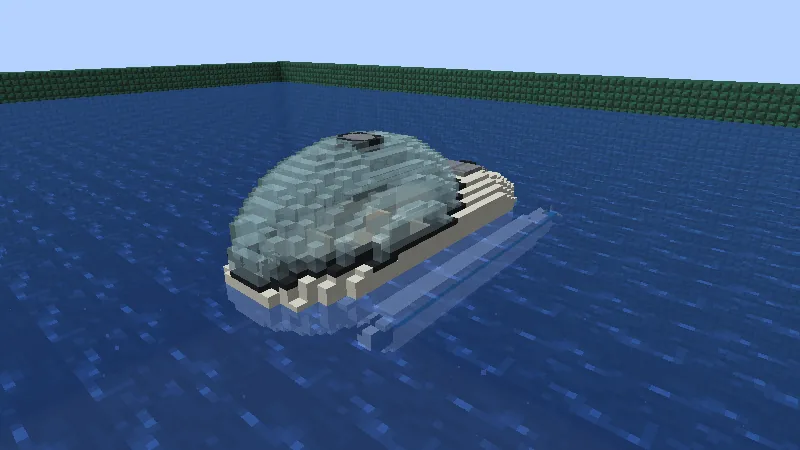
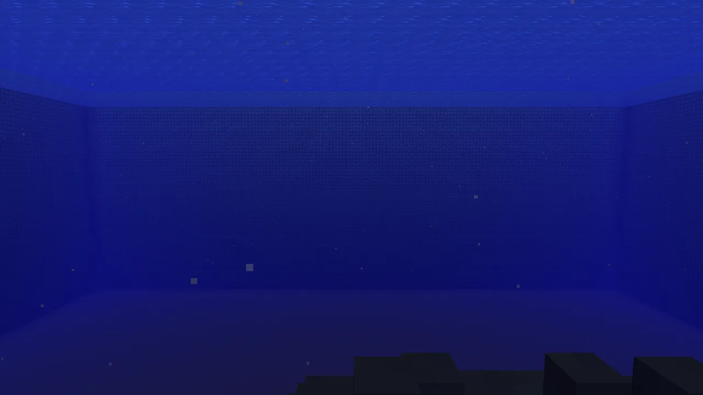
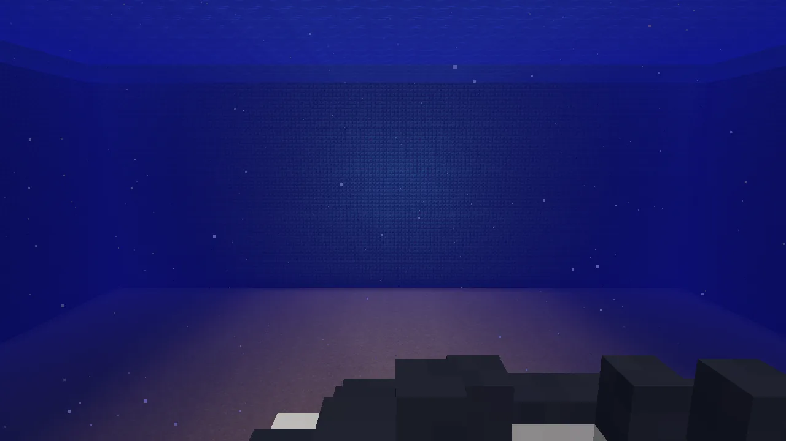
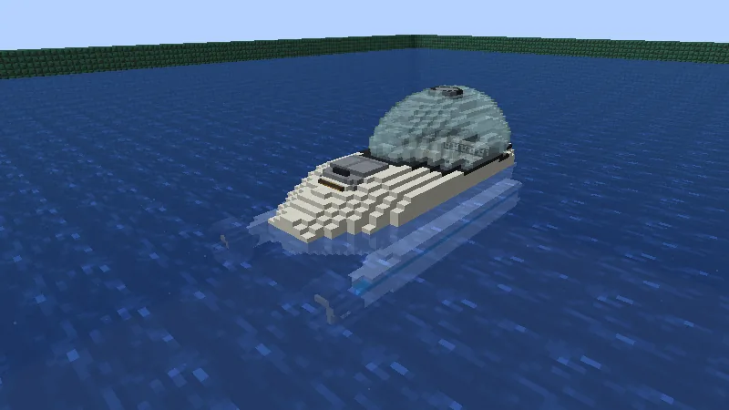
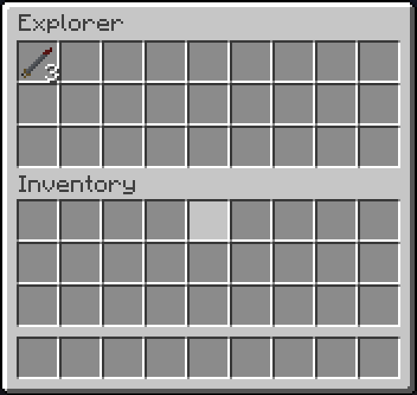

The **Explorer** is a personal submersible for four, one block a metre: a low white hull five
blocks long under a big glass bubble, with a pontoon along each side. Four ride two by two under the
bubble and see out all round. It is slow and tough, with a floodlight in the nose of each pontoon, a
propeller in a ring at each pontoon's tail, a hold as big as three rows of a chest, four upgrade
slots and two torpedo tubes. Diving works the same in every [Submersibles](/wiki/submersibles)
submarine, so read that page too. Keys, fuel, paint and repairs are
[Vanilla Wheels](/wiki/vanilla-wheels)'s.

## Getting one

1. **The hull**, at a crafting table: steel blocks round three glass blocks and a chest:

   | | | |
   |---|---|---|
   | steel block | glass | steel block |
   | glass | chest | glass |
   | steel block | steel block | steel block |

2. **The hull and an engine**, at a crafting table, make the Explorer, packed.
3. **Right-click open water** with it to set it down. (A Mechanic Lift builds one too, from the hull
   and an engine, but on dry land: pack it and carry it to the water.)

It comes out white. Paint it with a dye in its fit-out (crouch and right-click the hull); the teal
stripes on the pontoons stay teal.

## Aboard

The first one in is the pilot, in front on the left. From every seat you look out through the
bubble, which you can't see from inside:

**H** switches the floods in the pontoons' noses. Down where it's dark they light the seabed ahead.

**R** gets you out through the hatch in the top of the bubble.

## The hold

The hold is under the **hatch on the deck behind the bubble**: right-click the hatch (from a dock or
swimming above it), or press your **inventory key** (E) while you're aboard. Torpedoes for its tubes
go in here.

## Numbers

Top speed 0.22 blocks a tick (4.4 blocks a second); climbs and dives 0.08 a tick. 36 000 ticks of
fuel, and it burns fuel only while you drive it: about 25 minutes of driving. It is tough: knocks
and crashes do it a quarter of their damage. Repairs take **steel ingots**.
